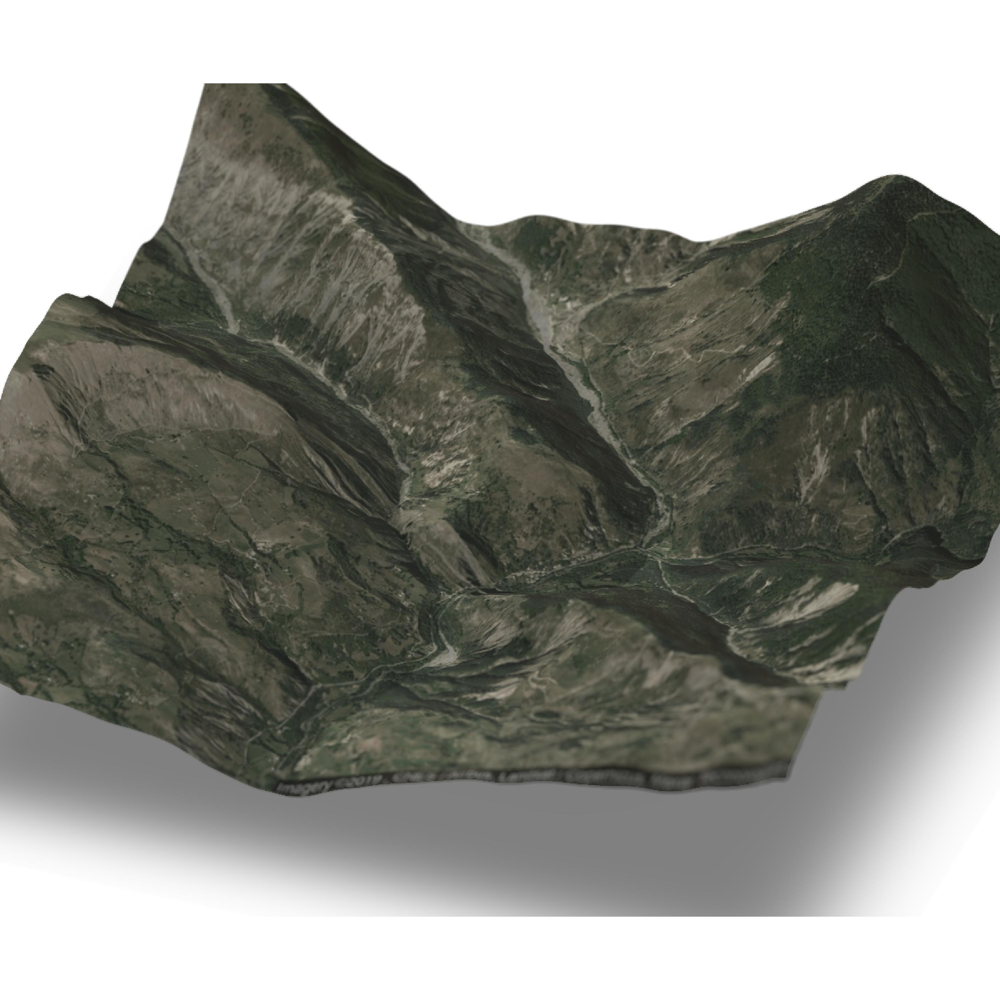

# GoogleMap_Overlay_Rayshader
A quick method for overlaying a Google Map satellite image on a  3D DEM using rayshader and ggmap packages.

##  
You'll need to download the height data from a source of your choice then play with the zoom settings in the ggmap 'get_googlemap' function to choose the extent of your choice... Note this workflow assumes that the resolution of your DEM will need to be coarser than the satellite image. I've run this with a 25m DEM which is then disagregated to match (or closely match) the resoltion of the satellite image.

loads of useful info to improve and modify this script here:
https://github.com/tylermorganwall/rayshader and
https://github.com/dkahle/ggmap

Here's an example of what you can make with this workflow...

